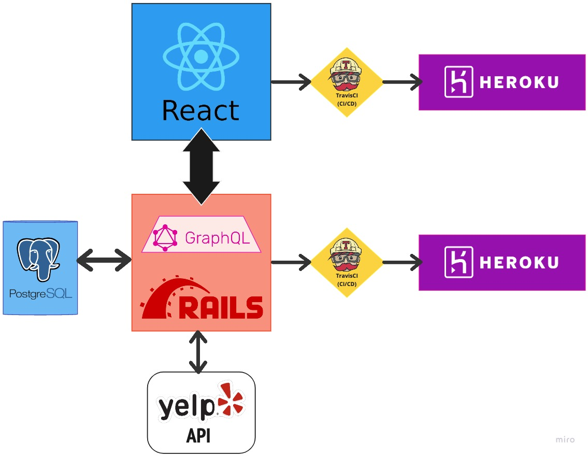
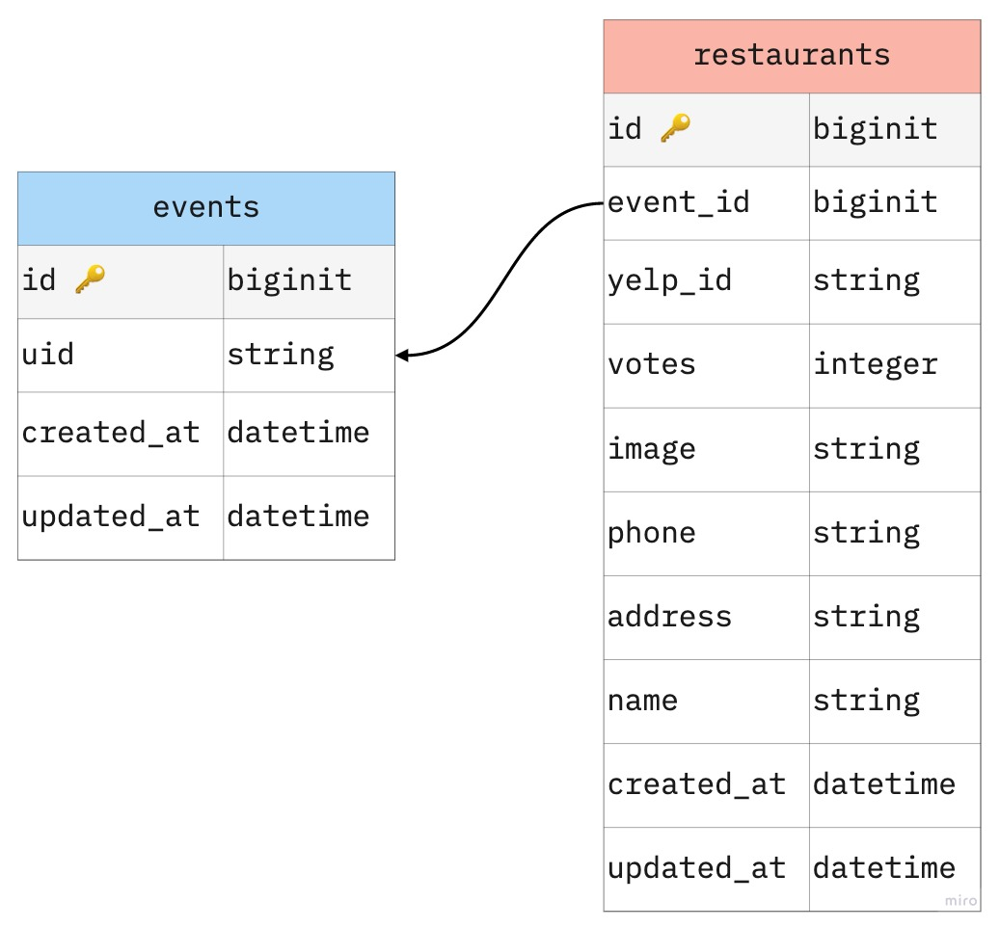

# "What We Eating?" Back-End

## About this Project
We are here to help you make that dreaded decision: **Where are we eating?**
Provide your zip code and we will show you a list of open restaurants.
Pick your top 3 and share them with your friends or family to get their 1st, 2nd, and 3rd choice. We will tally the rankings and show you all the winning restaurant. Let's go eat!


This repo houses **What We Eatin'?** Back-End. It has a combination of ReST API and GraphQL API, both built with Ruby on Rails and PostgreSQL. It provides data from Yelp API and logic to a React Front-End.


## Table of Contents

  - [Getting Started](#getting-started)
  - [Front-End Repo](#front-end-repo)
  - [Running the tests](#running-the-tests)
  - [Architecture](#architecture)
  - [DB Schema](#db-schema)
  - [Endpoints](#endpoints)
  - [Built With](#built-with)
  - [Versioning](#versioning)
  - [Authors](#authors)

## Getting Started

To get your local/development environment running, please fork and clone down the repo:
  ```shell
  $ git clone git@github.com:WhatWeEating/back-end-wwe.git
  ```

## Front-End Repo

-  You can find more information about the application at [GitHub Repo](https://github.com/WhatWeEating/front-end-wwe)
- Visit the deployed application on [Heroku](https://mysterious-cove-94790.herokuapp.com/)

### Prerequisites

To run this application you will need Ruby 2.5.3 and Rails 5.2.6

### Installing
Once you have forked and cloned the repo:
- Install the gem packages using [Bundler](https://bundler.io/)
  ```shell
  $ cd back-end-wwe
  $ bundle install
  ```

- Start with a clean database
  ```shell
  $ rails db:{drop,create,migrate,seed}
  ```

## Running the tests
RSpec testing suite is utilized for testing this application.
- Run the test suite and access test coverage files
  ```shell
  $ bundle exec rspec
  $ open coverage/index.html
  ```

## Architecture
The following is a depiction of the overall architecture for this application which includes a JavaScript Front-End application and a Rails Engine on the Back-End that calls out to Yelp's API.



## DB Schema
The following is a depiction of our Database Schema



## Endpoints
### Search Open Restaurants by Zip Code
`GET https://back-end-wwe.herokuapp.com/restaurants`
- **Required** params:
  - valid 5-digit zip code
  - unique event ID

<!-- Include example resquest and response here  -->

### Query Winning Restaurant Details
<!-- - **Required** query params:
  - `location`
  - `vintage` -->
<!-- Include example resquest and response here  -->

## Built With
- Ruby
- Rails
- GraphQL
- RSpec
- FactoryBot
- Faker


## Versioning
- Ruby 2.5.3
- Rails 5.2.6

## Authors
<!-- - **Ashish Malla**
| [GitHub](https://github.com/asiisii) |
  [LinkedIn](https://www.linkedin.com/in/adam-bowers-06a871209/) -->
- **Diana Buffone**
| [GitHub](https://github.com/Diana20920) |
[LinkedIn](https://www.linkedin.com/in/dianabuffone/)
- **Logan Anderson**
| [GitHub](https://github.com/loganjacob76)
<!-- - **Matt Craig**
| [GitHub](https://github.com/mcraig2342) |
- **Pat Findley**
|  [GitHub](https://github.com/Patfindley) |
    [LinkedIn](https://www.linkedin.com/in/patfindley/)
- **Robert DeRouin**
|    [GitHub](https://github.com/robertjosephderouin) |
    [LinkedIn](https://www.linkedin.com/in/robert-derouin-7a2601173/) -->
